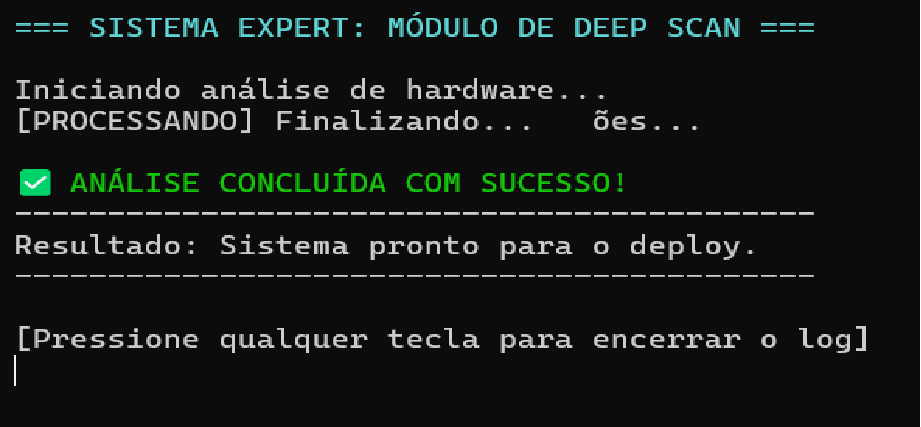

# una-ihcux-lista03
# 🖥️ ScannerExpert - Heurística de Nielsen

## 📌 Objetivo

Este projeto tem como objetivo demonstrar a aplicação da primeira heurística de usabilidade de Jakob Nielsen: **Visibilidade do status do sistema**.

## 🧠 Heurística Aplicada

A heurística de "Visibilidade do status do sistema" estabelece que o sistema deve sempre manter o usuário informado sobre o que está acontecendo, por meio de feedback claro e em tempo real.

## ⚙️ Funcionamento do Sistema

O sistema foi desenvolvido como uma aplicação de console em C#, simulando uma análise de hardware.

Durante a execução, são exibidas mensagens como:

* "Iniciando análise de hardware..."
* "[PROCESSANDO] ..."
* "Análise concluída com sucesso!"

Essas mensagens permitem que o usuário acompanhe o progresso da operação, reduzindo incertezas e melhorando a experiência de uso.

## 📸 Evidência de Execução

1. Acesse a pasta do projeto:
   cd ScannerExpert

2. Execute o comando:
   dotnet run

## ✅ Conclusão

O sistema atende à primeira heurística de Nielsen ao fornecer feedback contínuo ao usuário, informando claramente o estado atual do processo durante sua execução.
